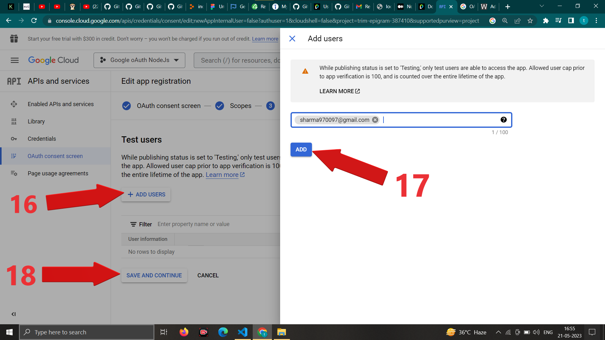

 # Google oAuth Using Passport.js Library in Node Js
 > By Rajesh Sharma 

 </br>

 ### To use google oAuth we need to follow this.

 - Before your application can make use of Sign In With Google, you must register your app with Google. 
 - This can be done in the APIs & Services page of the Google Cloud Platform console. 
 - Once registered, your app will be issued a client ID and secret which will be used in the strategy configuration.

 ### To register follow this .
 - Go to this url : https://console.cloud.google.com/ </br>
 
 - Sign in with your gmail id .
 
 
 
 
 
 
 
 
 
 
 
 
 
 
 
 
 
 
 
 
 
 
 
 


  After creating oAuth credentials 

  install npm packages 
  ```javascript
  
  PS C:\Users\rs\Desktop\google_oauth_using_passport_node_js> npm i --save express 
                                                              npm i --save express-session 
                                                              npm i --save passport 
                                                              npm i --save passport-google-oauth20 
                                                              npm i --save ejs
  ```

  
  

  Note : Chances are you will go through an error as "401. That’s an error. Error: invalid_client The OAuth client was not found" 
  solution : Check your dotenv (.env) file and make sure there would be no comma or semicolon there at the end of any line.

