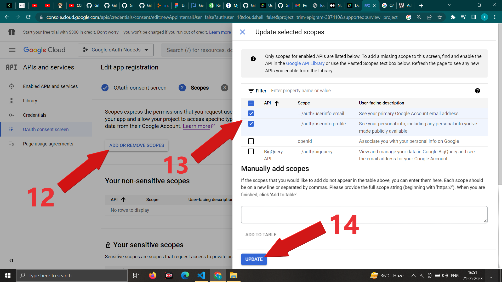

 # Google oAuth Using Passport.js(authentication middleware) Library in Node Js
 > Auther- Rajesh Sharma 

 </br>

 > ## First things first,Let's understand how passport Js library work.
  Passport js consist of two seprate library.
  First the "Passport Js" and the second is "Stretegy" library .

  ### Login process with Passport js happens in two parts.
  - Passport.js library - manage the session.(always required)
  - Strategy library - authentication or handle login process.(depends which strategy you want to use)  

   **Passport.js library**
   -  It is always required, You must install this authentication middleware library. 
   - It connect with "express-session" library to store the user information in req.session object. - It works with already logged in users.It doesn't play any role in authentication of user.
  - It maintains the session to store the authenticated information of user to authenticate again and logged in directely if previously user authenticated himself and not logged out yet.
  - In order to use passport js, you must install "express-session" package.
     

  **Stretagy library** 
  - It is like the which plateform authentication you want to authenticate by, for example - google, facebook, twitter,local etc. 
 - You choose any authentication strategy library which you want to use for authentication.
 - In current repo we'll use google oAuth authentication strategy library.
- With strategy we authenticate the request whether it is authenticate or not by the method(mechanism) provided by particular strategy.
-  They also provide the necessary data of paricular user to verify them,or store them in our database or use in our application to show their name,email etc. 

 </br>

 - When you authenticate user via user_name and password which you have saved in your database or locally. This is known as "local strategy".
  
  ```javascript
    
    /** Some most frequent used diffrent types of Strategy Library example.*/

    //  To use Local strategy, authenticate user by user_name and password
      $ npm install passport-local

    // To use Google strategy install npm package
      $ npm i --save passport-google-oauth20    // (used in current repo. )

    // Another npm package for Google strategy 
      $ npm install passport-google-oidc

    // To use Facebook strategy install npm package
     $ npm install passport-facebook

    // To use twitter strategy install npm package
     $ npm install passport-twitter
    
    // To use instagram strategy install npm package
     $ npm install passport-instagram

    // To use linkedin strategy install npm package
    $ npm install passport-linkedin

    // To use github strategy install npm package
    $ npm install passport-github2   
    .
    .
    . //so on and so forth .

  ```

  
 

 **Have you ever noticed when you logged in with your any email using google oauth on any application,How do they welcome you with your name without asking your name,and get you a pop up screen with already filled with your basic details like name,email,date of birth, photos and says to complete your profile or do it later on.**

 - They get your basic details such as email id, photos,name and other general information from the strategy you use to login like : login with google or facebook or twitter etc.The information you get what used Strategy scope returns. 
 - Further we'll see while creating client Id for google oAuth authentication, how we select the user information scope that what information we want, once the user gets login.


### To use google oAuth we need to genreate the client ID,client secret for our application first.

 - Before using google oAuth (login with google) in our application, We must register our application with google cloud console. 
 - On google console cloud page, in the APIs & Services page,We can genreate our application's client ID & secret.
 - Once registered, your app will be issued a client ID and secret which we will be using in the strategy configuration.

 ### To register our application's client ID & secret on google cloud console follow this .
 - Go to this url : https://console.cloud.google.com/ 
  - Sign in with your gmail id .

 

 <!--  -->
 - after login click on select a project and then create a new project.
 
 - give your project name click create.
 
 <!--  -->
 - then select your recent created project and go to explore and enable APIs section.
 
 <!--  -->
 <!--  -->
 <!--  -->
 <!--  -->
 - select oAuth consent screen, for development purpose we choose external then it start in testing mode otherwise for production we need to verify our app.
 
 - enter your app information such as app name user support email
 
 - then providing app domain for local server on testing purpose we'have used https://localhost:3000 and developer contact information after giving it click on save and continue.
 
 

 <!--  -->
 - then select add scope, scope means what information you want once your gets logged in successfully.
 
 <!--  -->
 
 - then add user for testing who can login in testing mode.
 
 <!--  -->
 <!--  -->
 - then going on credential section and selecting web application type filling following details.
 
 
 
 - now copy the created client ID & secret of your project or download as json which we'll be using in strategy configuration.
 


  After creating oAuth credentials 

  install npm packages 
  ```javascript
  
  PS C:\Users\rs\Desktop\google_oauth_using_passport_node_js>$ npm i --save express 
                                                             $ npm i --save express-session 
                                                             $ npm i --save passport 
                                                             $ npm i --save passport-google-oauth20 
                                                             $ npm i --save ejs
                                                             $ npm i --save dotenv
  ```

 then create a `.env` file and add the  following envorinment variables.

 ```dosini
      
    # our registered application's client_id and client_secret from google cloud console to use in google oAuth. 
    CLIENT_ID      = 'replace_your_client_id_here'
    CLIENT_SECRET  = "replace_your_client_secret_here"

    # callback url to redirect user after successfully authenticated
    CALLBACK_URL   = 'http://localhost:3000/auth/google/callback'

    # port initialization to run our server at.
    PORT           =  3000

    # A session secret is a key used for encrypting cookies.
    SESSION_SECRET =  "your_secret_key"
```  
 > Note : Mistake we can make as a begginer.
 >  Chances are you will go through an error as "401. 
 > Error: invalid_client The OAuth client was not found" 
 > solution : Check your dotenv (.env) file and make sure there would be 
 > no comma or semicolon there at the end of any line as above.

 then creating our main `index.js` file 

 ```javascript
     
        /** Requiring modules */
    const express         = require("express");
    const session         = require("express-session");
    const passport        = require("passport");  
    const GoogleStrategy  = require('passport-google-oauth20').Strategy  // Requiring GoogleStrategy class  
    const path            = require("path");
    require("dotenv").config();
    require("ejs"); 
    


    /**creating an app */
    const app = express() ;


    /** serve static files */
    app.use(express.static(path.join(__dirname,"public"))) ;

    /** Set ejs as view engine  */
    app.set('views', path.join(__dirname, 'public/views'))
    app.set("view engine","ejs");

    /** session middleware configuration  */
    app.use(session({
      secret:process.env.SESSION_SECRET,  // this helps express to create an unique session id while encrypting cookies to store information.
      resave:false, // don't save session if unmodified    
      saveUninitialized:true,
       cookie:{               // in development we use local server as http so if it'll we true now,
         secure:false,       // then session will not create cookies and store in browser coz cookies will only travle on secure connection as https,
         maxAge: 60000      // and thus it'll not store cookies on local server as http but it will on secure connection as https,
      },                   // The default value is { path: '/', httpOnly: true, secure: false, maxAge: null }. we do not need to proactively write.but in              
    }))                   // production we need configure accordingly .  
                           
                          

    
    /** Initialize passport */                      
    app.use(passport.initialize()) ;  // init passport on every route call of our app.  
    
   /** As the user navigates from page to page, the session itself can be authenticated using the built-in session strategy. 
     * Because an authenticated session is typically needed for the majority of routes in an application, 
     * it is common to use this as application-level middleware, after session middleware.
     * app.use(passport.authenticate('session'));
     * This can also be accomplished, more succinctly, using the passport.session() alias.  */
     app.use(passport.session())  ;   // allow passport to use "express-session . Note : before this statement 
                                     //you must configure the session middleware and order of these 
                                    //should be same first,passport.initialize() then passport.session()
                                   // when app.use(session({..})) invoked it creates an "req.session" object.
                                  // and when passport.session() invoked it add an additional object as "req.session.passport".

    

    let oAuthOption = {
      clientID     : process.env.CLIENT_ID,
      clientSecret : process.env.CLIENT_SECRET,
      callbackURL  : process.env.CALLBACK_URL, 
    } ;

    /** connect our app to google oAuth
     * GoogleStrategy(option,callback_func)  
     */ 
    passport.use(new GoogleStrategy(oAuthOption,function(accessToken,refreshToken,profile,callback){
        // Use the profile information to authenticate the user    
        callback(null,profile) ;  // we can save the profile data in our data base using a insertion query here if we want.
    }))
    
    /** after user successfully logged in passport will call to serializeUser to read and store the profile information to the user browser and create a session id  */
       passport.serializeUser(function(user,callback){    // it store all the user information in "req.session.passport.user.{..}"        
        callback(null,user) ;
       });

       passport.deserializeUser(function(obj,callback){  // after serialization it calls the deserialize user to attach user information in "req.user",
        callback(null,obj) ;                            //  it takes the last object of "req.session.passport.user.{...}" and attach to "req.user",
       });                                             //   which can be accesible anywhere in app in "req.user".
    


       /** requset handler for Home (login page) */
       app.get("/login",(req,res)=>{
        if(req.isAuthenticated()){           // Note : passport js provides an function "req.isAutenticated()" to check on every route whether 
            res.redirect("/dashboard");     //         the req is authenticated or not to access our pages, we can use it to our any req handler 
        }else{                             //  it returns true if the user is authentic else return false .
        res.render("login.ejs") ;
        }
       })


     /** once user click on button of login page, handler for that route and serving option to login via google mails */
        app.get('/auth/google',passport.authenticate('google',{scope :["profile","email"]})) ;  // Authenting with google and in scope- getting user's profile and email 
                                                                                             // Scope means what data we want once the user get authenticated or logged in.
                                                                                            // passport.authenticate is a middleware to authenticate user 
                                                                                           // it has diffrents strategy as, google,local,facebook,twitter,etc.
      
                                                                                        

    /** callbackURL handler after user successfully logged in */
        app.use("/auth/google/callback",passport.authenticate('google',{failureRedirect:"/login"}),(req,res)=>{       // in callback we again check and make sure it is authenticated ,            
            res.redirect("/dashboard")  ;                                                                            // if it fails to authenticate redirect to login page again. else redirect to dashbord
        }) ;
                                                                                                     

    /** req handler for dashboard */  
      app.get("/dashboard",(req,res)=>{   
        if(req.isAuthenticated()){       //passport provides a method in req to check if the request is authenticated or not before serving the any page after login.
           res.render("dashboard.ejs",{
            user : req.user,
        });
        }else{
            res.redirect("/login");
        }
      })  

    /** req handler for logout  */
      app.get("/logout", (req, res) => {
        req.logout(function (err) {          //  req.logout() provided by passport js to clear the both sessions object of "req.session.passport"
          if (err) {                        //  and the “req.user" object
            console.log(err);
          } else {
            res.redirect("/login");
          }
        });
      });

    
      /** Handling non-matching request with 404 page not found */
      app.all("*",(req,res)=>{
        res.status(404).send("Page not found");
       
      })
      
      /** Listening our server at port 3000 */
       app.listen(3000 || process.env.PORT,()=>{
        console.log("Server is listening on port 3000");
       })

 ```
 
  ## Folder structure look like following 

   


> Thank you for checking out this repo,Hoping it helped you. Note : if you found anything incorrect pls let me know.

 Rajesh Sharma 
 
 <a href="https://linkedin.com/in/rajesh-sharma75/" target="_blank">

</a>