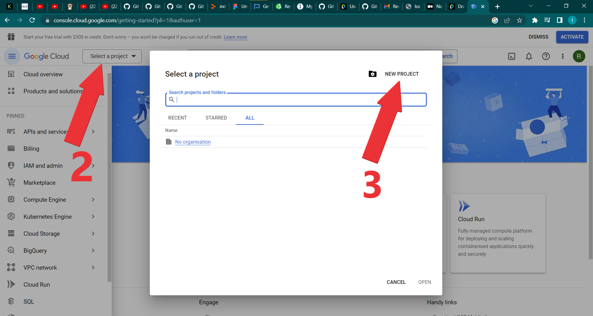

 # Google oAuth Using Passport.js Library in Node Js
 > By Rajesh Sharma 

 </br>

 > ## First things first,Let's understand how passport Js framework work.
  Passport js consist of two seprate library.
  First the "Passport Js" and the second is "Stretegy" library .

  ### Login process with Passport js happens in two parts.
  - Passport.js library - manage the session.(always required)
  - Strategy library - authentication or handle login process.(depends which strategy you want to use)  

   **Passport.js library**
   -  It is always required, You must install this. 
   - It connect with "express-session" library to store the user information in req.session object. - It works with already logged in users.It doesn't play any role in authentication of user.
  - It maintains the session to store the authenticated information of user to authenticate again and logged in directely if previously user authenticated himself and not logged out yet.
  - In order to use passport js, you must install "express-session" package.
     

  **Stretagy library** 
  - It is like the which plateform authentication you want to authenticate by, for example - google, facebook, twitter,local etc. 
 - You choose any authentication strategy library which you want to use for authentication.
 - In current repo we'll use google oAuth authentication strategy library.
- With strategy we authenticate the request whether it is authenticate or not by the method(mechanism) provided by particular strategy.
-  They also provide the necessary data of paricular user to verify them,or store them in our database or use in our application to show their name,email etc. 

 </br>

 - When you authenticate user via user_name and password which you have saved in your database or locally. This is known as "local strategy".
  
  ```javascript
    
    /** Diffrent types of Strategy Library example.*/

    //  To use Local strategy, authenticate user by user_name and password
      $ npm install passport-local

    // To use Google strategy install npm package
      $ npm i --save passport-google-oauth20    // (used in current repo. )

    // Another npm package for Google strategy 
      $ npm install passport-google-oidc

    // To use Facebook strategy install npm package
     $ npm install passport-facebook

    // To use twitter strategy install npm package
     $ npm install passport-twitter

    .
    .
    . //so on and so forth .

  ```

  
 

 **Have you ever noticed when you logged in with your any email using google oauth on any application,How do they welcome you with your name without asking your name,and get you a pop up screen with already filled with your basic details like name,email,date of birth, photos and says to complete your profile or do it later on.**

 - They get your basic details such as email id, photos,name and other general information from the strategy you use to login like : login with google or facebook or twitter etc.The information you get what used Strategy scope returns. 
 - Further we'll see while creating client Id for google oAuth authentication, how we select the user information scope that what information we want, once the user gets login.


### To use google oAuth we need to genreate the client ID,client secret for our application first.

 - Before using google oAuth (login with google) in our application, We must register our application with google console. 
 - On google console cloud page, in the APIs & Services page,We can genreate our application's client ID & secret.
 - Once registered, your app will be issued a client ID and secret which we will be using in the strategy configuration.

 ### To register our application's client ID, secret on google cloud console follow this .
 - Go to this url : https://console.cloud.google.com/ </br>
 
 - Sign in with your gmail id .
 
 
 
 
 
 
 
 
 
 
 
 
 
 
 
 
 
 
 
 
 
 
 
 


  After creating oAuth credentials 

  install npm packages 
  ```javascript
  
  PS C:\Users\rs\Desktop\google_oauth_using_passport_node_js>$ npm i --save express 
                                                             $ npm i --save express-session 
                                                             $ npm i --save passport 
                                                             $ npm i --save passport-google-oauth20 
                                                             $ npm i --save ejs
                                                             $ npm i --save dotenv
  ```

 Note : Chances are you will go through an error as "401. That’s an error. Error: invalid_client The OAuth client was not found" 
  solution : Check your dotenv (.env) file and make sure there would be no comma or semicolon there at the end of any line.